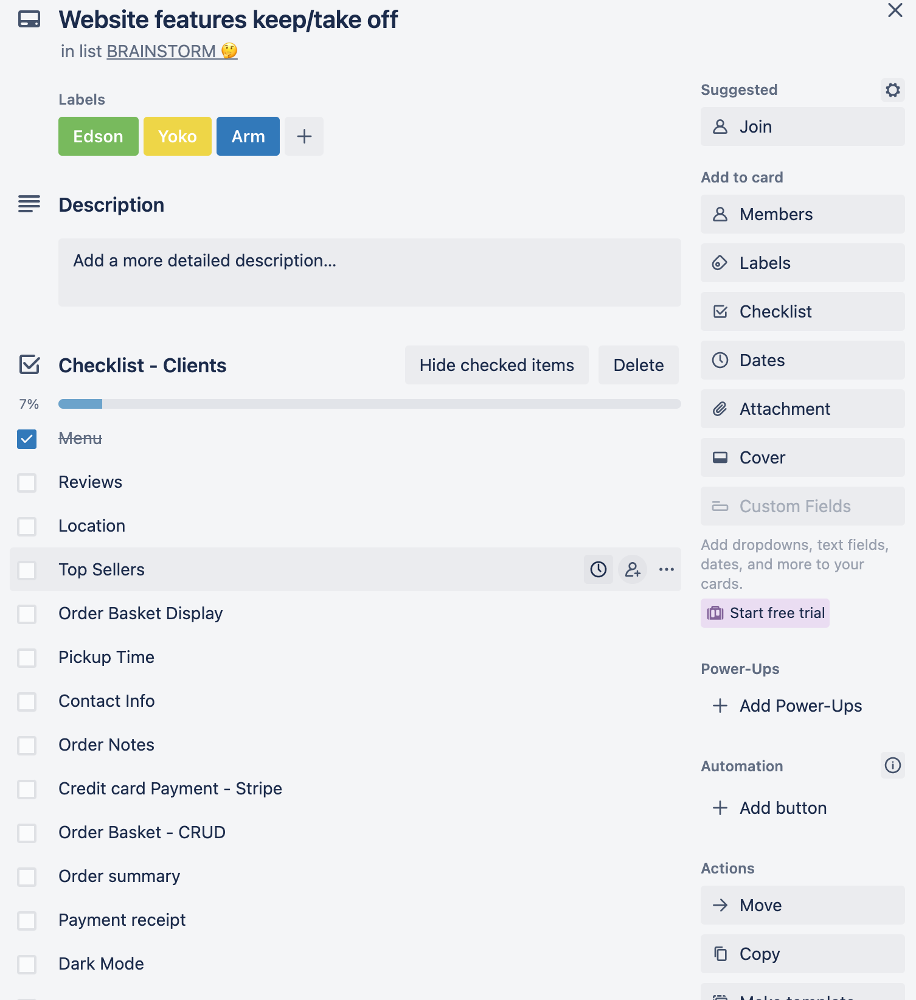

**<h1>SushMe</h1>**
*<h4>THE solution for early start-up food stalls looking to share their dilectable dishes far and wide</h4>*

### [sushMe Online Purchases webpage](https://sushme.netlify.app/)  
   

---  

### [sushMe Table QRCode, In store Purchase, webpage](https://sushme.netlify.app/table/2)  
  
  
---  

### [sushMe Admin Panel Webpage](https://sushme.netlify.app/adm) - Admin Panel username: `test@gmail.com` password: `123456`  `* Login Required`

   
  
---      

*<h3>[github API repo](https://github.com/Kryptic2020/sushme_api)</h3>*
*<h3>[github client repo](https://github.com/Kryptic2020/sushme_client)</h3>*  

---  
  

## Under Construction - Not fully implemented features  
* Dark mode
* Translation JP
* Manage Staff
---
**<h2>Introduction (R1)</h2>**

- Purpose
    * It isn't easy starting a culinary business. Besides the fact that owners have to be constantly be focusing on making the best quality product, they also have to consider legal regulations, where and how to sell, and -- most importantly -- how to get customers to consider trying their food. Trying to make a name for one's business in the early days often means going to farmers' markets and festivals in the hope that enough people will try the product and start raving about it to their local and non-local network. If only there was an easy way to take the burdens of selling the product off the shoulders of these benign Atlas' and automating this process. Now there is. 
    * SushMe is for the up-and-comers. For the food business that doesn't have the time or resources to focus on spreading their name far and wide. Those that want to move forward as technology evolves and share their product with customers faster and more conveniently. We are creating a platform that will put the power of online marketing, viewing, and ordering in the hands of the customer so that start up food stalls can focus on doing what they do best: Making delicious food.
    * The beauty of SushMe is the fact that it is a platform. In the future buisnesses will be able to use our service to instantly create a website with order functionality. All they will have to do is upload their own logo and color schemes and they will have a personalised site that represents what they are and what they make. 
- Functionality/Features
    * Online Ordering:
        * First and foremost, we want the business to be able to extend their ability to take orders. The natural solution to this? Put the power to purchase in the literal hands of the consumer. Rather than having to wait in a line, why not find a comfortable spot at your local farmers' market, place and order, and wait until your phone or other device notifies you that your food is ready to be picked up. 
    * Online Menu 
        * No one likes pushing their way in front of Hangry Humans (TM) just to grab a menu. We will create an easy to read online menu that simplifies this issue and saves us from the haranguing by the hangry. 
    * Barcode scanning 
        * A crucial feature for first time buyers. The barcode approach allows the purchaser to instantly access the application rather than having to know a link or ask someone how to navigate to the website. This is important for food stalls at farmers' markets who may lose out on a customer if it takes too long to actually get to the actual act of ordering. 
    * Admin priveleges for business owners to edit according to their desire
        * It is important for food stalls to have the ability to quickly edit their menus. Hot items often sell out fast and, as a user, few things are more frustrating than deciding on what you want only to find out that it is out of stock. With this feature owners can quickly update their menus and in the future change them according to what they choose to sell on that particular day. Variety is the spice of life, after all. 
    * Lean and Clean
        * While it doesn't sit at the top of the list, clean and easy to use applications are an absolute must for a business that wants to be taken seriously. The user should not be over-inundated with options. Instead, they should be directed by flows to simple choices that are easy to make and pay off well. 
    * Reusability
        * SushMe is only the beginning. We plan to grow this concept into something much more broad and create a platform that, in the future, can be quickly adopted by numerous food stall start-ups. 
- Target Audience
    * We have segmented our traget audience by expected time of adoption. 
        1. Start up food stalls that have no online presence. 
            * This is the group we plan to immediately focus on. They will be first adopters of our application and will be the R0 as far as bloom is concerned. These are businesses that have no website functionality to speak of and are in need of immediate help in order to get their presence felt online.
        2. Larger businesses looking for a more clean online experience for their web functionality. 
            * By using the successful adoption of group one we will be able to leverage group two into considering to go with our platform over their own. This will mainly be due to bloom and how smaller businesses, as they start to pull market share from larger ones, force larger groups to try and adopt the lean methods of the former. 
- Tech Stack 
    * As far as languages are concerned, we will use the following:
        * Javascript, Ruby, HTML 5, CSS
    * For our database: 
        * PostgreSQL
    * Frameworks to be utilized: 
        * Ruby on Rails, React
    * Finally, we will deploy and host our site on the two hosting services below as well as using Github as our remote repository. 
        * Heroku, Netlify, Github
---

**<h2>Dataflow Diagram (R2)</h2>**

* 
---

**<h2>Application Architecture Diagram (R3)</h2>**

* 
---

**<h2>User Stories (R4)</h2>**

1. Marina, as a customer, wanted to order a meal from Hiro Meshi at Nundah market but there was a long queue in front of her. She found a QR code at the front of the shop and scanned it on her phone. Then it redirected to Hiro Meshi’s website and showed her the menu of the stall. She was able to see photos, prices, and descriptions of the menu and order items from the website. After she ordered, a payment screen appeared and it went to a confirmation screen as well as a waiting time. After the waiting time, she went up to the stall and was happy to be able to get the items she ordered.

2. Yoko is a busy mom looking after a 3 year-old. One of her favourite things to do on the weekend is to go to Nundah market on Sundays to treat her and her family with some takeaway meals for breakfast and lunch. This gives her time off from cooking for her family. The only thing she felt was inconvenient was to that she had to wait for the line to order and go back to the food stall to get her items ordered. She has heard that her the food stall, Hiro Meshi, has introduced a new system that allows for ordering online. She visited the website and ordered her and her son’s usual breakfast and paid online. It showed the time to pick up so she was able to get her items the moment they were ready. She was very happy to be able to organise her family’s breakfast and avoid all the hassles she usually has.

3. Yuki is the owner of the food stall, Hiro Meshi in Nundah market on Sundays. She wants to upsell her items on her stall and streamline the flow of the customers queuing in front of the stall. She signed up for the new app, Sushme, and was able to add new items to sell and streamline her payment system with its intuitive and easy to use interface. It helped her business grow, enhance sales, and make her customer's happier.
---

**<h2>Wireframes (R5)</h2>**

* [link](https://xd.adobe.com/view/4c37c164-3576-47fd-a313-42e0a21f2b37-1964/) to wireframes created using AdobeXD with link functionality to make the wireframes navigable by those who are interested in testing out how the app would work.

* 
* 
* 
* 

---

**<h2>Trello Board (R6)</h2>**
## [Trello Board Link](https://trello.com/b/htQigG7B/sushme-20)

* 
* 
* 
* 
* 